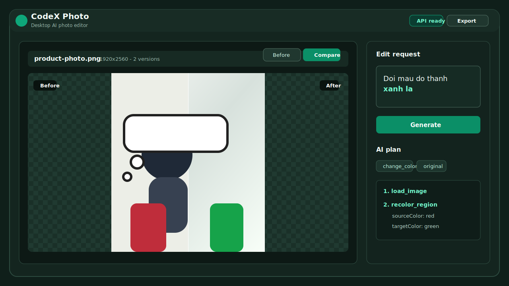
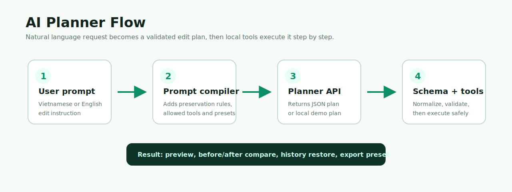
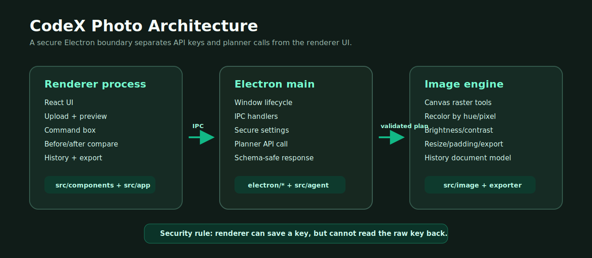

# CodeX Photo

CodeX Photo là prototype desktop app chỉnh sửa ảnh bằng AI workflow: người dùng tải ảnh lên, nhập yêu cầu bằng tiếng Việt hoặc tiếng Anh, app tạo kế hoạch chỉnh sửa có kiểm tra schema, chạy các tool xử lý ảnh cục bộ, hiển thị trước/sau, lưu lịch sử và xuất ảnh theo preset thương mại.

Ứng dụng được thiết kế cho bài toán rất thực tế: người bán hàng online cần chỉnh ảnh nhanh cho Shopee, TikTok Shop, story/reels hoặc giữ nguyên tỉ lệ gốc mà không phải học Photoshop.

> Trạng thái hiện tại: MVP desktop chạy được. API dùng để lập kế hoạch chỉnh sửa; phần thực thi ảnh trong bản này vẫn là Canvas/local tools. Những thao tác như segmentation/inpainting thật là hướng mở rộng tiếp theo.



## Nội dung

- [Tính năng chính](#tính-năng-chính)
- [Demo nhanh](#demo-nhanh)
- [Cài đặt và chạy](#cài-đặt-và-chạy)
- [Cấu hình API key](#cấu-hình-api-key)
- [Cách hoạt động](#cách-hoạt-động)
- [Kiến trúc](#kiến-trúc)
- [Tool chỉnh sửa được hỗ trợ](#tool-chỉnh-sửa-được-hỗ-trợ)
- [Script npm](#script-npm)
- [Cấu trúc thư mục](#cấu-trúc-thư-mục)
- [Xử lý lỗi thường gặp](#xử-lý-lỗi-thường-gặp)
- [Giới hạn hiện tại](#giới-hạn-hiện-tại)
- [Roadmap](#roadmap)

## Tính năng chính

- Desktop app bằng Electron, không chỉ là web page chạy trong browser.
- Upload ảnh, preview ảnh gốc và ảnh sau chỉnh sửa.
- So sánh trước/sau bằng chế độ split view.
- Nhập yêu cầu tự nhiên: ví dụ `Đổi màu đỏ thành xanh lá`, `Làm nền trắng kiểu Shopee`, `Làm sáng ảnh và nét hơn`.
- AI planner tạo JSON edit plan có schema rõ ràng.
- Local Canvas engine thực thi các chỉnh sửa phổ biến.
- History panel để khôi phục các phiên bản trước.
- Export PNG/JPEG/WebP theo chất lượng chọn được.
- Preset xuất ảnh: Original ratio, Shopee 1:1, TikTok Shop 4:5, Story/Reels 9:16.
- Settings bảo vệ API key qua Electron main process.
- Demo mode fallback khi chưa có API key hoặc muốn chạy offline tương đối.
- One-click runner trên Windows: chỉ cần chạy `RUN_CODEX_PHOTO.cmd`.

## Demo nhanh

Một workflow cơ bản:

1. Chạy `.\RUN_CODEX_PHOTO.cmd`.
2. Bấm `Tải ảnh lên`.
3. Nhập yêu cầu chỉnh sửa, ví dụ:

```text
Đổi màu đỏ thành xanh lá
```

4. Bấm `Tạo ảnh`.
5. Xem kế hoạch AI, so sánh trước/sau.
6. Chọn preset xuất ảnh và bấm `Xuất`.

Ví dụ prompt nên thử:

```text
Làm nền trắng, căn giữa sản phẩm, giữ nguyên logo và chữ
```

```text
Tăng sáng ảnh, tăng tương phản nhẹ, làm nét hơn
```

```text
Đổi màu đỏ thành xanh lá nhưng giữ nguyên ánh sáng và chất liệu
```

## Cài đặt và chạy

### Yêu cầu môi trường

- Windows 10/11.
- Node.js 20+ được khuyến nghị.
- npm đi kèm Node.js.
- Kết nối mạng cho lần tải dependency/Electron đầu tiên.

### Cách chạy nhanh nhất trên Windows

Mở PowerShell tại thư mục project rồi chạy:

```powershell
.\RUN_CODEX_PHOTO.cmd
```

File runner này sẽ tự:

- kiểm tra Node.js và npm,
- cài dependency nếu chưa có `node_modules`,
- kiểm tra Electron runtime,
- tải Electron runtime nếu thiếu,
- compile Electron main process,
- bật Vite dev server nội bộ,
- mở cửa sổ desktop CodeX Photo.

Sau lần đầu tiên, chạy lại sẽ nhanh hơn vì dependency và Electron runtime đã có sẵn.

### Chạy thủ công bằng npm

```bash
npm install
npm run dev
```

Nếu Electron báo thiếu runtime:

```bash
npm run electron:install
```

## Cấu hình API key

CodeX Photo có 2 chế độ:

- `Demo mode`: dùng planner rule-based và Canvas local approximation.
- `API mode`: gọi OpenAI-compatible API để tạo edit plan, sau đó app thực thi các tool local.

Cách cấu hình:

1. Mở app.
2. Bấm `Cài đặt`.
3. Dán API key.
4. Chọn model nếu cần.
5. Tắt `Demo mode` nếu đang bật.
6. Bấm lưu.

API key được gửi vào Electron main process để lưu và sử dụng. Renderer không đọc lại raw API key; UI chỉ hiển thị trạng thái đã có key hoặc chưa.

## Cách hoạt động

CodeX Photo không gửi ảnh thẳng vào một tool "magic edit" duy nhất. App tách bài toán thành 2 lớp:

- Planner: hiểu yêu cầu người dùng và sinh edit plan dạng JSON.
- Executor: chạy từng command trong plan bằng tool registry.



Ví dụ edit plan rút gọn:

```json
{
  "intent": "change_color",
  "target": "uploaded_image",
  "preserve": ["product_identity", "logo", "text", "realistic_shadows"],
  "steps": [
    {
      "tool": "load_image",
      "target": "uploaded_image",
      "parameters": {}
    },
    {
      "tool": "recolor_region",
      "target": "requested_region",
      "parameters": {
        "sourceColor": "red",
        "targetColor": "green",
        "strength": 0.88
      }
    }
  ],
  "export_preset": "original",
  "risk_warnings": [],
  "explanation_vi": "Đổi vùng gần màu đỏ sang xanh lá, giữ nguyên kích thước ảnh."
}
```

Schema parser có bước normalize để xử lý các biến thể model hay trả về, ví dụ:

- `product identity` -> `product_identity`
- `brand labels` -> `brand_labels`
- `riskWarnings` -> `risk_warnings`
- `exportPreset` -> `export_preset`
- `adjust lighting` -> `enhance_product_photo`
- `Shopee 1:1` -> `shopee_square`

## Kiến trúc



### Electron main process

Chịu trách nhiệm:

- tạo cửa sổ desktop,
- đăng ký IPC handlers,
- lưu settings/API key,
- gọi planner API,
- trả về plan đã validate cho renderer.

File liên quan:

- `electron/main.ts`
- `electron/preload.ts`
- `electron/ipc.ts`
- `electron/secure-store.ts`

### Renderer process

Chịu trách nhiệm:

- UI upload/preview,
- prompt input,
- before/after compare,
- plan panel,
- history panel,
- export panel,
- chạy Canvas editing tools.

File liên quan:

- `src/app/App.tsx`
- `src/app/editor-store.ts`
- `src/components/editor/*`
- `src/image/*`

### Agent layer

Chịu trách nhiệm:

- compile prompt,
- gọi planner,
- validate schema,
- normalize output từ AI,
- dispatch từng edit step.

File liên quan:

- `src/agent/prompt-compiler.ts`
- `src/agent/prompt-planner.ts`
- `src/agent/edit-plan-schema.ts`
- `src/agent/tool-registry.ts`
- `src/agent/execute-edit-plan.ts`

## Tool chỉnh sửa được hỗ trợ

| Tool | Mục đích | Trạng thái MVP |
| --- | --- | --- |
| `load_image` | Nạp ảnh đầu vào | Có |
| `preserve_logo_text` | Đăng ký rule giữ logo/chữ | Có |
| `replace_background` | Thay nền gần đúng | Approximation |
| `center_product` | Căn ảnh vào canvas preset | Có |
| `recolor_region` | Đổi màu vùng gần màu nguồn | Có, dựa trên pixel/hue |
| `adjust_brightness` | Tăng/giảm sáng | Có |
| `adjust_contrast` | Tăng/giảm tương phản | Có |
| `adjust_exposure` | Chỉnh exposure | Có |
| `adjust_saturation` | Chỉnh bão hòa | Có |
| `adjust_temperature` | Chỉnh nhiệt màu | Có |
| `sharpen` | Làm nét gần đúng | Có |
| `blur_background` | Làm mờ gần đúng | Approximation toàn raster |
| `denoise` | Khử nhiễu nhẹ | Approximation |
| `resize` | Resize ảnh | Có |
| `rotate` | Xoay ảnh | Có |
| `add_padding` | Thêm padding/nền | Có |
| `export_image` | Chuẩn bị canvas xuất preset | Có |
| `segment_subject` | Tách chủ thể | Placeholder |
| `create_mask` | Tạo mask | Placeholder |
| `refine_mask` | Tinh chỉnh mask | Placeholder |
| `remove_object` | Xóa vật thể | Approximation |

## Export preset

| Preset | Kích thước | Ghi chú |
| --- | ---: | --- |
| Original ratio | Giữ kích thước/tỉ lệ ảnh hiện tại | Không tự co ảnh khi chỉ đổi màu |
| Shopee 1:1 | 1024x1024 | Nền trắng, phù hợp ảnh sản phẩm |
| TikTok Shop 4:5 | 1080x1350 | Nền trắng |
| Story/Reels 9:16 | 1080x1920 | Nền trắng |

## Script npm

| Script | Mục đích |
| --- | --- |
| `npm run dev` | Build Electron main process, chạy Vite và mở Electron |
| `npm run start:desktop` | Chạy PowerShell runner |
| `npm run electron:install` | Tải/cài Electron runtime |
| `npm run build` | Build Electron + Vite production assets |
| `npm run build:electron` | Compile TypeScript cho Electron main/preload |
| `npm run lint` | Chạy ESLint |
| `npm run typecheck` | Chạy TypeScript typecheck |
| `npm run test` | Chạy unit tests bằng Vitest |
| `npm run smoke` | Chạy smoke checks |
| `npm run verify` | Chạy lint, typecheck, test, smoke, build |

## Cấu trúc thư mục

```text
CodeX_Hackathon/
├─ electron/                 # Electron main, preload, IPC, secure store
├─ src/
│  ├─ agent/                 # Planner, schema, tool registry, executor
│  ├─ app/                   # App shell, desktop API bridge, Zustand store
│  ├─ components/
│  │  ├─ editor/             # Upload, preview, command box, plan, export, history
│  │  ├─ layout/             # Top bar, settings dialog, app shell
│  │  └─ ui/                 # UI primitives
│  ├─ image/                 # Canvas tools, export, image document model
│  ├─ lib/                   # Constants, validators, storage, errors
│  └─ types/                 # Shared TypeScript types
├─ docs/                     # Architecture, agent flow, demo notes
├─ tests/                    # Vitest unit tests
├─ scripts/                  # Runner/smoke scripts
├─ RUN_CODEX_PHOTO.cmd       # One-click Windows launcher
└─ package.json
```

## Xử lý lỗi thường gặp

### App đứng ở bước tải Electron

Lần đầu chạy, Electron runtime có thể cần tải file zip khá lớn. Nếu mạng chập chờn, runner sẽ thử nguồn chính và mirror. Chạy lại:

```powershell
.\RUN_CODEX_PHOTO.cmd
```

Nếu vẫn lỗi, thử:

```bash
npm run electron:install
```

### Vẫn thấy Demo mode sau khi nhập API key

Kiểm tra trong `Cài đặt`:

- API key đã được lưu.
- `Demo mode` đã tắt.
- Badge trên top bar hiển thị trạng thái API.

### "Kế hoạch AI trả về không đúng schema"

Planner API đôi khi trả JSON lệch format. App đã có normalize layer cho nhiều trường hợp phổ biến, nhưng nếu model trả một field/enum hoàn toàn mới thì schema vẫn sẽ chặn để tránh chạy tool sai.

Cách xử lý:

- xem toast lỗi có `path`, `expected`, `received`,
- bổ sung alias trong `src/agent/edit-plan-schema.ts`,
- hoặc chỉnh prompt trong `src/agent/prompt-compiler.ts`.

### Đổi màu chưa đúng vùng mong muốn

Bản MVP đổi màu dựa trên pixel/hue gần màu nguồn, chưa có semantic mask. Ví dụ `đỏ -> xanh lá` sẽ đổi các vùng gần màu đỏ trong ảnh, nhưng chưa hiểu "áo", "túi", "logo" như một object riêng nếu không có mask.

### Ảnh bị nhỏ lại khi xuất

Với `Original ratio`, app giữ nguyên kích thước ảnh hiện tại. Với preset marketplace như Shopee/TikTok/Story, app sẽ đưa ảnh vào canvas preset có nền trắng, nên ảnh có thể được căn giữa với padding.

## Giới hạn hiện tại

- Chưa có segmentation thật.
- Chưa có inpainting/object removal thật.
- API planner chưa đồng nghĩa với generative image editing.
- Demo mode chỉ là Canvas approximation.
- Chưa có installer `.exe` đóng gói/signed release.
- Chưa có batch export nhiều ảnh cùng lúc.

## Roadmap

- Tích hợp model image edit thật để chỉnh ảnh theo prompt và mask.
- Thêm semantic segmentation cho sản phẩm/người/nền.
- Thêm mask editor thủ công.
- Thêm batch workflow cho seller.
- Thêm template prompt cho Shopee, TikTok Shop, Facebook Marketplace.
- Thêm installer Windows.
- Thêm signed release và auto-update.
- Thêm export profile lưu sẵn theo shop.

## Tài liệu thêm

- [Architecture](docs/architecture.md)
- [AI Agent Flow](docs/ai-agent-flow.md)
- [Demo Script](docs/demo-script.md)
- [Product Notes](docs/product-notes.md)

## Ghi chú phát triển

Repo này ưu tiên minh bạch: nếu một tool chưa làm được semantic edit thật, app sẽ báo approximation hoặc skip an toàn thay vì giả vờ đã chỉnh bằng AI đầy đủ. Điều đó giúp prototype dễ demo, dễ debug và dễ nâng cấp sang pipeline AI thật sau này.
